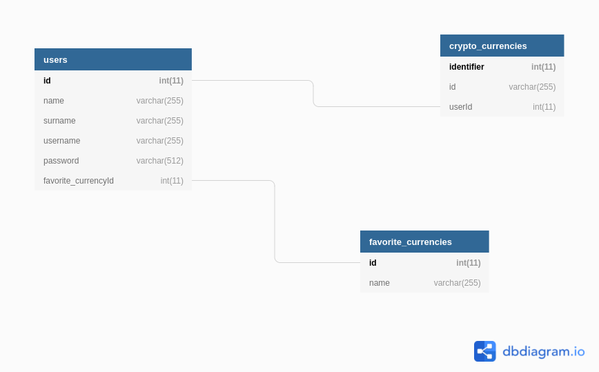

# Base de datos
#### La base de datos esta creada por medio de  <a href="https://www.mysql.com/"> Mysql</a> y con el orm <a href="https://sequelize.org/master/manual/getting-started.html"> Sequelize </a>
 
 

##### Diagrama base de datos
